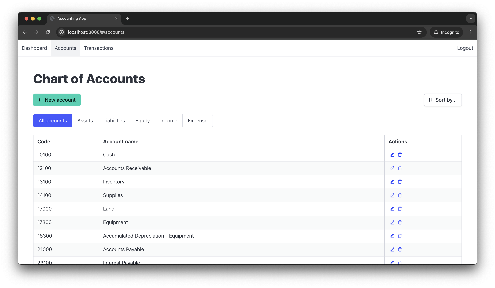
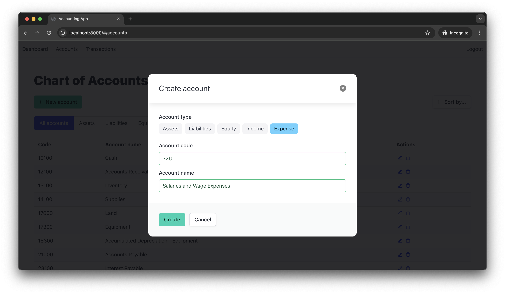
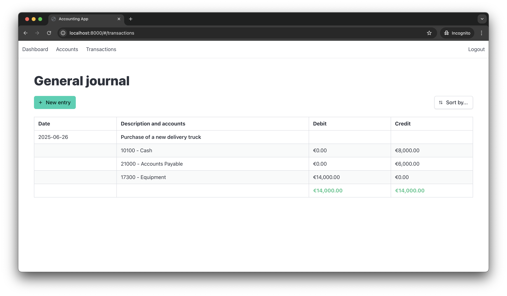
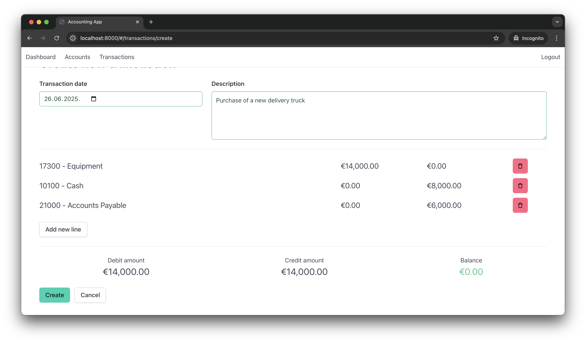

# Accounting application

Web based accounting application, that supports double entry accounting and multi tenancy. Written with Spring and Angular


## About the Project

The goal of this project was to create a simple, yet complete double entry accounting application. To achieve this task, relevant academic sources were reviewed, as well as other general ledger accounting systems (such as Quickbooks or SevDesk).

The system allows to manage different payment accounts (assets, liabilities, equity, income and expenses) and organize transactions in the form of a general ledger. The dashboard includes several quick report widgets (profit loss, net worth, expense categories). Detailed customized reports are to be implemented. The application supports unlimited organizations and each user can have different roles in different organizations. Role based authentication was implemented on the backend side to protect user data.

## Features

This section presents a list of features supported by this project, both implemented and planned:

- Double entry accounting
- Transactions can have multiple transaction entries as long as the double entry accoutning rule confirms
- Payment accounts categorized by type (assets, liabilities, equity, income, expense)
- Chart of accounts bootstraps (generates) for newly created organizations
- Multi organization support
- Role based access control
- OAuth authentication with Keycloak
- Dashboard with widgets (profit loss, net worth, expense categories) that are based on last 30 days
- Managing users in organizations [TODO]
- Transaction category auto suggestions [TODO]
- Recurring transactions [TODO]
- Reporting (cash flow, balance sheet etc) [TODO]
- Export data to CSV, LibreOffice and PDF [TODO]

## Tecnhologies used

This project is implemented using client server architecture. In addition, both frontend and backend code are allocated in a single code base (task requirement). Following technologies were used:

- Backend: Java, Spring, Spring Security, Hibernate, PostgreSQL, JUnit, Keycloak
- Frontend: TypeScript, Angular, RxJs, Bulma

## Architecture

From the practical point of view, the project makes use of layered architecture pattern and client service pattern. The system makes use of client server architecture that separates the frontend part from the backend part. Typically, the frontend application runs on client premises (browsers for web based applications and mobile devices for native mobile applications). The server part is executed on a server. This way, the same server can serve multiple client instances.

The architecture of the project is presented on the C4 diagram below:


## Setup

The project can be run manually or using Docker [TODO].

### Manual setup

To run the application manually make sure to have following dependencies installed:

- Java 24
- PostgreSQL 17+
- Node 22.16+
- Keycloak

You need to complete following steps:

1. Clone the source code
2. Create a new database with following credentials:
- Username: ```accounting_user```
- Password: ```secret```
- Database name: ```accounting_db```
3. Create a new keycloak realm:
- name: ```accounting```
- email as username: ```on```
4. Create a new keycloak client:
- name: ```accounting-angular```
- valid redirect URLs: ```http://localhost:4200/*```
- web origins: ```http://localhost:4200```
5. Run the backend application: ```./mvnw spring-boot:run```
6. Install frontend dependencies and run the frontend:
```
cd accouunting-app
npm install
ng serve
```
7. Access the application on ```http://localhost:4200```

## Screenshots

Current state of the project:









## Author

(C) 2025 Iurii Mednikov iurii.mednikov@iu-study.org

The code is delivered under terms of the MIT software license. For more information, check the ```LICENSE.txt``` file.