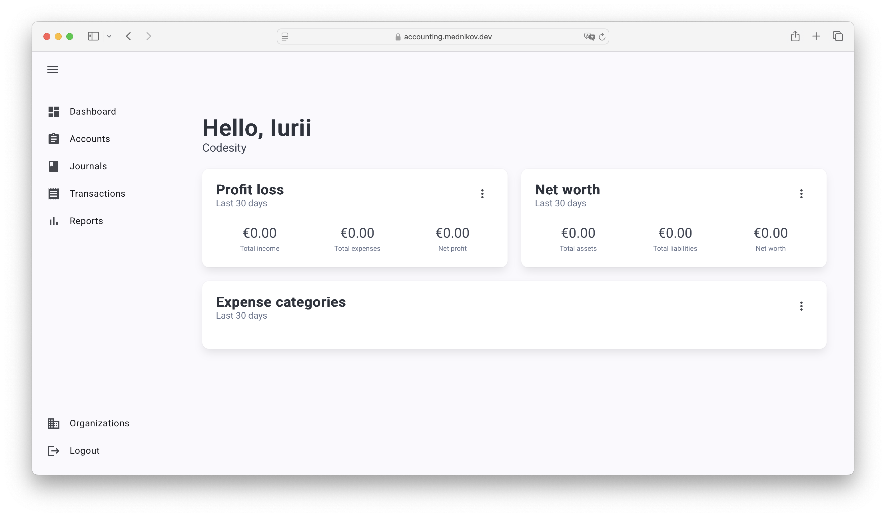
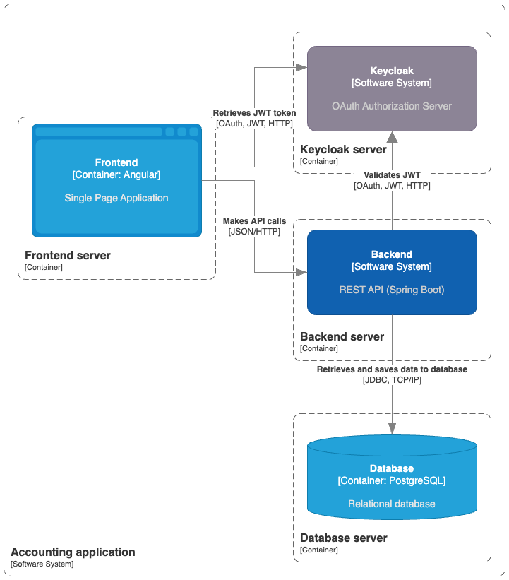
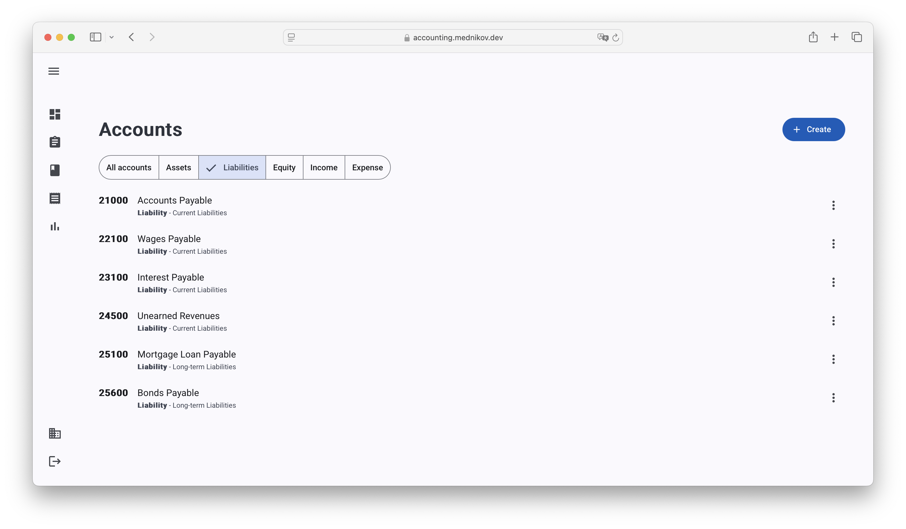
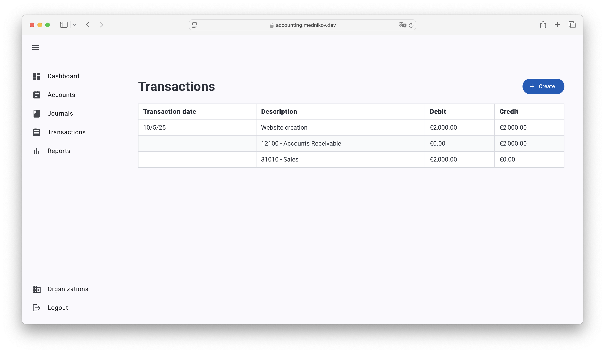
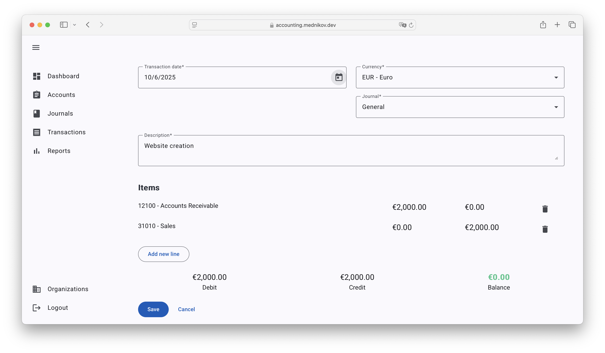

# Accounting application

Cloud SaaS general ledger accounting platform that supports multi tenancy, multi currency and reporting. Started as a submission for "Software Engineering" course at IU University Of Applied Sciences (received 1.7 score).

[LIVE DEMO](https://accounting.mednikov.dev)


## About the Project

The initial goal was to implement a complete SaaS application that can handle both domain tasks (accounting) as well as all SaaS common functionality (such as multi tenancy, user management etc).



As the result, this project was created after thorough domain research. As for now, it has more functionality than most advanced SaaS platforms on the market. For instance, here you have multi currency support out of the box - premium feature for most accounting "giants" 😎

## Features

Following functionality is already implemented. I also list here some planned features that will come in subsequent releases.

- Full support for double entry accounting with custom journals (books)
- Each transaction (journal entry) can have unlimited number of lines, as long as balance is preserved (_debits_ = _credits_)
- Chart of accounts with accounts categorized by type (assets, liabilities, equity, income, expense)
- Automatically generated chart of accounts, journals, and currencies for newly created organizations
- Multi organization support with fully customized roles and authorities (_how many advanced platforms have that_?)
- Role-based access control
- Invitation support
- OAuth 2.0 authentication with Keycloak
- Dashboard with widgets (profit loss, net worth, expense categories)
- Multi-currency support with external API support to retrieve historical exchange rates
- Financial reporting: cash flow, balance sheet
- Support for recurring transactions [TODO]
- Auto suggest transaction categories [TODO]
- Export data to CSV, LibreOffice, and PDF [TODO]

## Tech stack

This project is implemented using client server architecture. In addition, both frontend and backend code are allocated in a single code base (task requirement). Following technologies were used:

- Backend: Java, Spring, Spring Security, Hibernate, PostgreSQL, Flyway, JUnit, Keycloak
- Frontend: TypeScript, Angular, RxJs, NgRx Signal Store, Angular Material
- DevOps: Docker, Github Actions

## Setup

The project uses Docker for deployment and is deployed on VPS using Github Actions. However, you can also run it manually without Docker.

### Docker (easy way)

It is easy to run this app using Docker and Docker compose. You should have following installed:

- Docker or Podman
- Docker compose

Please note that Keycloak is not included in Docker compose, because the idea is that the app should be easily integrated into an existing workflow.

1. Install Keycloak
2. Create a new keycloak realm:
- name: ```accounting```
- email as username: ```on```
3. Create a new keycloak client:
- name: ```accounting-angular```
- valid redirect URLs: ```http://localhost:8080/*```
- web origins: ```http://localhost:8080```
4. Clone this repository
5. Create an ```.env``` file with:

```env
SPRING_KEYCLOAK_URL={Path to keycloak}
```
6. Start the app

```bash
docker compose up -d
```

7. The application runs on ```http://localhost:8080```

### Manual setup (also easy, but requires more steps)

To run the application without Docker make sure to have following dependencies installed:

- Java 24
- PostgreSQL 17+
- Node 22.16+
- Keycloak

You need to complete following steps:

1. Clone this repository
2. Create a new database with the following credentials:
- Username: ```accounting_user```
- Password: ```secret```
- Database name: ```accounting_db```
3. Create a new keycloak realm:
- name: ```accounting```
- email as username: ```on```
4. Create a new keycloak client:
- name: ```accounting-angular```
- valid redirect URLs: ```http://localhost:4200/*```
- web origins: ```http://localhost:4200```
5. Run the backend application: ```./mvnw spring-boot:run```
6. Install frontend dependencies and run the frontend:
```
cd accouunting-app
npm install
ng serve
```
7. Use the application on ```http://localhost:4200```

## Architecture

The application utilizes a client server architecture with separate apps for backend (Spring) and frontend (Anglular). Apps can be deployed separately, although as per task requirements they are organized into a single deployment artifact.

The architecture of the project is presented on the C4 diagram below:



## Frontend migration

Since version 0.0.4, the frontend application was moved to the separate project. It can be accessed in this [github repository](https://github.com/mdnkv/accounting-app). Consequently, hash URLs and Maven frontend pipeline were abandoned.

## Screenshots

The frontend combines both Angular Material (mainly form components) and Bulma (for flex layouts)

The current state of the project:


Dashboard



Chart of Accounts



Transactions



Create a new transaction

## Author

(C) 2025 Iurii Mednikov ```iurii.mednikov@iu-study.org```

The code is delivered under terms of the MIT software license. For more information, check the ```LICENSE.txt``` file.